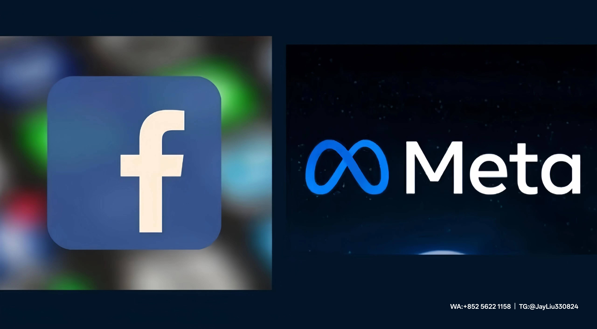

# Facebook广告进阶策略：突破流量瓶颈的创新玩法
## 一、动态广告策略的三维度拆分法  
**1. 受众生命周期管理矩阵**  
- **认知阶段（0-3天）**：通过轮播广告展示5组产品使用场景图，结合"每日新发现"系列标签建立初步印象  
- **兴趣阶段（3-7天）**：投放15秒悬念式短视频，前3秒突出用户痛点，最后2秒设置"点击解密"行动号召  
- **转化阶段（7天+）**：使用即时体验广告格式，嵌入可直接下单的Shopify店铺模块  
**2. 内容节奏调控技巧**  
- **黄金4小时法则**：新品首发阶段每4小时轮换素材，测试3组主图文案（福利型/场景型/数据型）  
- **节庆内容日历**：提前30天搭建话题日历（如#BackToSchoolWeek），配套设计模板化素材  
- **跨平台素材复用**：将TikTok爆款视频二次剪辑为1:1竖版规格投放Instagram动态  
## 二、视觉工程学：让素材自带传播基因  
**1. 视觉元素配比公式**  
- **焦点区**（画面中央40%）必须包含核心产品图，建议商品占比≥65%  
- **对比度池**（四周60%）使用互补色块/粒子特效构建视觉张力  
- **彩蛋区域**（右侧10%空白）植入品牌IP形象或浮动优惠码  
**2. 跨媒体制作规范**  
| 广告类型 | 尺寸比例 | 元素密度 | 动态元素建议 |  
|----------|----------|----------|--------------|  
| 信息流   | 1:1      | ≤3个焦点 | 微动效按钮   |  
| 快拍     | 9:16     | 单焦点   | 滑动进度条   |  
| 轮播     | 4:5      | 阶梯构图 | 跨屏衔接动画 |  
实操工具建议：  
- 视觉排版神器：Figma布局网格系统+Canva动态元素库  
- 素材智造流：Pexels实时热图工具+Remove.bg智能抠图  
## 三、智能投放系统的深度驯化  
**1. 机器学习参数调优**  
- 启用动态创意优化(DCO)时设置3项硬约束：  
  ① 主文案禁止随机组合  
  ② 折扣信息锁定展现位  
  ③ LOGO强制显示时长≥1秒
  
- 归因模型混合策略：  
  首日点击归因（品牌广告）+ 7天浏览归因（效果广告）  
**2. 自动化战役编排**  
```mermaid  
graph LR  
A[新品Awareness] -->|CPM≤$5| B[兴趣培育]  
B -->|CTR≥2%| C[转化推动]  
C -->|CVR≥5%| D[再营销]  
D -->|ROAS>3| E[忠诚计划]
